# Odoo asynchronous backend service alternative for heavy tasks

  


This project is a minimalist asynchronous backend service for [Odoo](https://www.odoo.com) with [Docker](https://www.docker.com).

The main goal of this small project is to handle those heavy backend tasks in a different environment using an external server.

In certain situations, you may need to deal with tasks that consume many resources, which could affect your Odoo performance, or maybe those tasks are in a Django server, and you want to connect this with Odoo.

The two main components will be Odoo as the primary server and the external server to process the heavy tasks, both asynchronously working.


To accomplish this, I used Docker to pack all the necessary tools together.

The docker solution contains:

- [Django](https://www.djangoproject.com) document app that implements the [Django-rest-framework](https://www.django-rest-framework.org) to populate the REST-API.

- [Celery](https://github.com/celery/celery) as a scheduler that runs the document app tasks asynchronously.

- The document app uses the [EasyOCR](https://github.com/JaidedAI/EasyOCR) library for the OCR processing. (You can replace this with [Amazon Textract](https://aws.amazon.com/textract/))

- [Postgres](https://www.postgresql.org) as the Database (with GIS in case you want to store the coordinates of the recognized text)
- [Nginx](http://nginx.org) as the proxy (Uswgi)


Notes:

You can replace the OCR task with something else you need by editing the document app or the Celery settings.


### The asynchronous workflow

1 - Odoo cron job sends the documents to the external service through the rest-API

2- The external server runs the OCR recognition task and saves the results.

3- The external server sends back to odoo the OCR processing result for each document.


To test this project, download this repository, and run docker-compose up.

```bash
docker-compose up
```


After the docker-compose built is ready, you need to configure the Django app and the Odoo module.


## Django

Log in to the Django container to apply the migrations. From your terminal, run this command.

```bash
docker exec -it django bash
```

Run the migrations. (If something goes wrong, try **python manage.py makemigrations** first)

```bash
python manage.py migrate
```

Create a superuser providing a user, password, and email

```
python manage.py createsuperuser
```

You can create multiple users if you have numerous odoo instances to connect to the OCR server.

Create a token for the Odoo user from the terminal:

```bash
python manage.py drf_create_token Odoo
```


In the auth token section, you will see the relation between the token and the user.

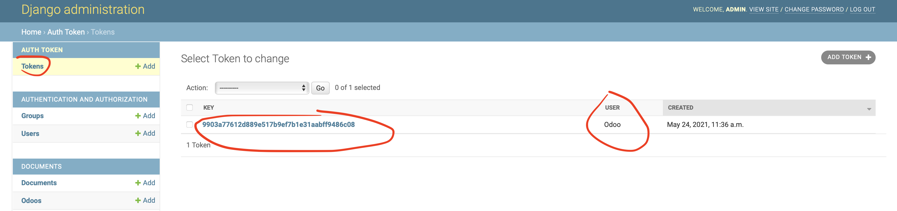


If you try to access the /documents/ rest-API, you won't connect unless you use a valid token.

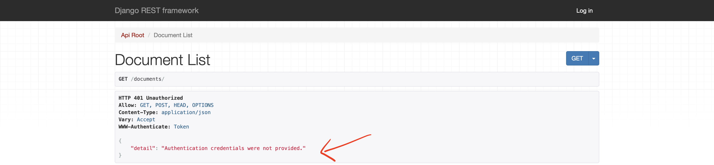


## Odoo

Add the **document_ocr** Odoo module in your odoo addons_path folder, and update the app list so you will find it.

Install the **document_ocr** module.

Once the installation is complete, go to the general settings and search for the OCR setting to define a new OCR connector.

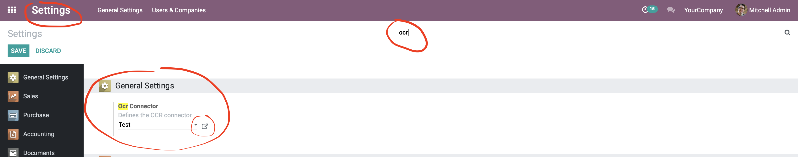


Set a name, the Django user name, the service URL, and the token you created in Django

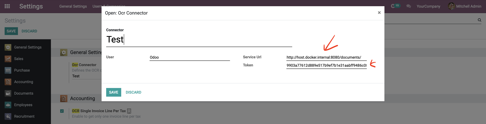


Got to> Settings > Technical > Scheduled Actions to configure the cron job


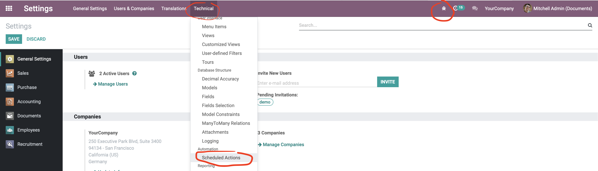


You can configure the **Send documents to OCR** cron job as you need.


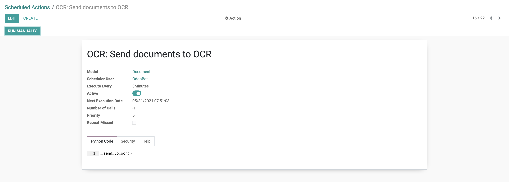


Go to the Documents app > Configuration> Workspaces and define the workspaces you want to synchronize with the OCR service.

Check the **Ocr Sync** for it. 

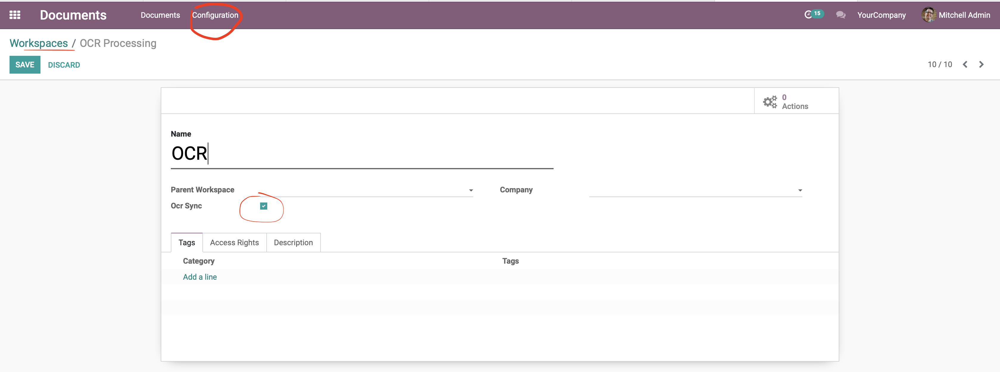


Once the configuration is done, you can upload documents to the workspaces.


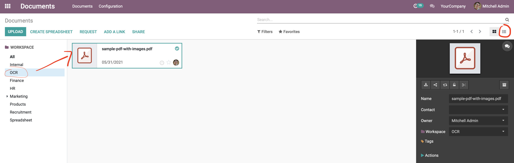

Use the documents list view and selected the hidden OCR columns: **OCR Sen**t and **OCR text**.

The **OCR sent** checked means that the document was sent to the OCR server.

The **OCR text** is the recognized text found by the OCR.


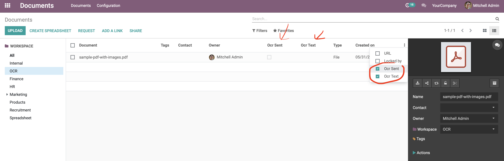


From Django, you can see what you received from Odoo in the documents admin list.


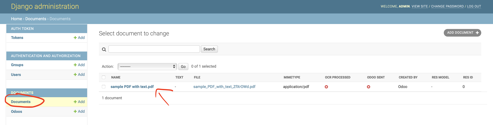


Once the OCR task process a document, you will sell the OCR processed checked and green as below.

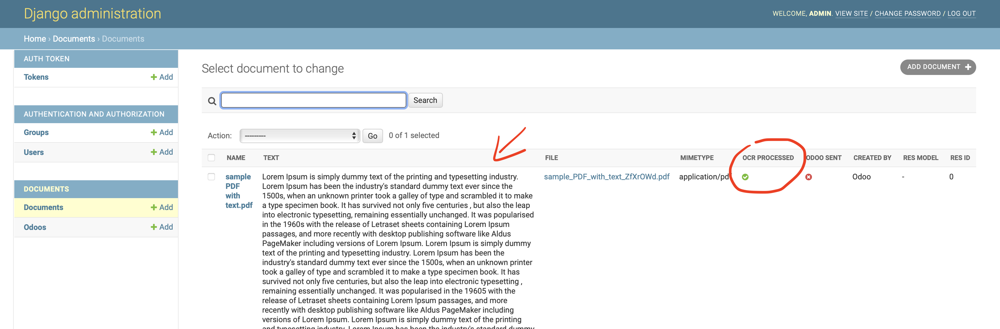


Once the task was sent to Odoo, you will see the Odoo sent checked and green.

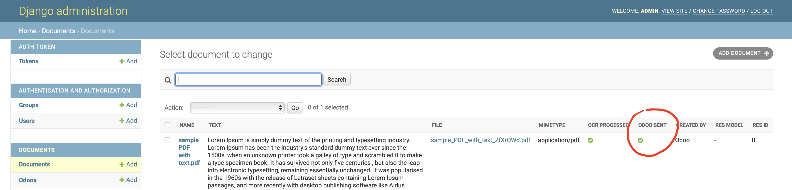


In Odoo, you will see the OCR text received from the OCR server.

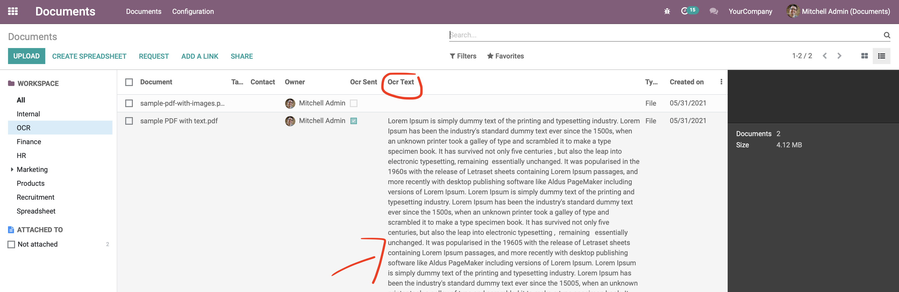

